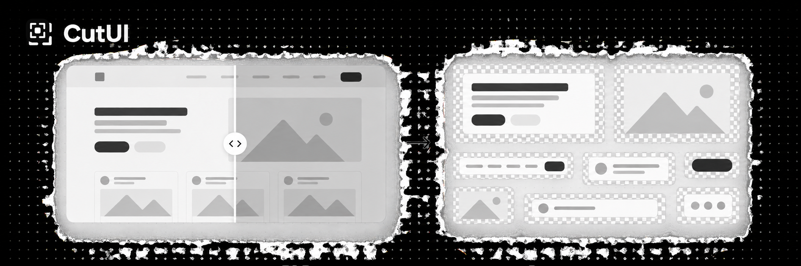

<p align="center">
  
</p>

<h1 align="center">CutUI</h1>

<p align="center">
  Turn screenshots into clean, reusable UI assets — directly in your browser.
</p>

<p align="center">
  <a href="https://cutui.ozturkenes.com"><strong>Try CutUI →</strong></a>
</p>

## What is CutUI?

CutUI is a fast, client-side proof of concept for extracting interface elements from screenshots. Drop in a UI screenshot and export either the complete composition as a transparent PNG or every detected element as a ZIP of separate PNG assets.

It is useful when you build interfaces in code but need individual cards, inputs, buttons, charts, or panels for Figma, social posts, presentations, and motion work.

## Highlights

- **Pixel-faithful output** — foreground pixels come from the original screenshot; they are not regenerated by an image model.
- **Two export modes** — download the full transparent composition or every detected element as a ZIP.
- **Original resolution** — crops are exported from the full-resolution source image.
- **UI-aware extraction** — protects crisp borders and recovers low-contrast containers such as cards, banners, and pill inputs.
- **Runs locally** — processing happens on your device with browser Canvas APIs.
- **No backend or AI inference** — no upload pipeline, model cost, or API key required.

## How it works

1. Drop, choose, or paste a PNG, JPG, or WebP screenshot.
2. CutUI estimates the page background from the image boundary.
3. Background-connected pixels and shadows are removed while UI borders are preserved.
4. A bounded analysis pass detects individual interface surfaces and grouped elements.
5. The final PNG and element crops are exported from the original-resolution image.

The result can be previewed on transparent, white, or black backgrounds before download.

## Run locally

No build step or dependency installation is required.

```bash
git clone https://github.com/enesozturk/ui-asset-extractor-poc.git
cd ui-asset-extractor-poc
python3 -m http.server 4173 --directory dist
```

Open [http://localhost:4173](http://localhost:4173).

## Project structure

```text
dist/
├── index.html       # Product interface
├── styles.css       # Visual system and responsive layout
├── app.js           # Extraction, detection, preview, and export logic
├── favicon.svg      # CutUI mark
└── demo-ui-input.png
```

## Current scope

CutUI works best on flat or softly graded page backgrounds. Complex photography, noise, glassmorphism, and backdrop blur remain difficult edge cases for this lightweight browser-only approach.

The output is a pixel-faithful raster asset rather than an editable Figma component. The current goal is a fast, useful POC with inexpensive compute and no server dependency.

## Privacy

Your screenshots stay on your device. CutUI does not upload them to a server.

---

Built by [Enes Öztürk](https://x.com/enesozturkdev).
